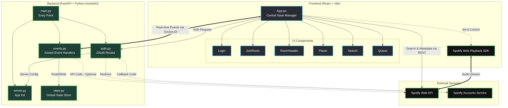

# VibeSync Architecture

VibeSync is a real-time collaborative music listening application. It uses a clean, modular architecture separating the React frontend from the Python FastAPI backend, communicating primarily over WebSockets for real-time state synchronization.

## System Overview

The application follows a client-server model where:
- **Frontend**: Handles user interaction, music playback via Spotify SDK, and state visualization.
- **Backend**: Manages room states, user presence, queues, and history using in-memory storage.
- **Socket.IO**: Facilitates bidirectional, real-time communication for events like "play", "pause", "skip", and "queue update".

## Architecture Diagram

## Module Descriptions

### Frontend (`frontend/src/`)
*   **`App.jsx`**: The root container. It initializes the Socket connection, manages the Spotify Player instance, and holds the global application state (current track, queue, users).
*   **`components/Player.jsx`**: Visualizes the current song, progress bar, and playback controls.
*   **`components/Queue.jsx`**: Displays the "Up Next" queue and "History" tabs. Handles removal and re-queuing of tracks.
*   **`components/Search.jsx`**: Provides a search bar tapping into the Spotify API to add songs to the room.
*   **`components/RoomHeader.jsx`**: Shows room info and a list of active users (avatars).

### Backend (`backend/app/`)
*   **`main.py`**: The application entry point. It imports the routers and runs the Uvicorn server.
*   **`server.py`**: Initializes the `FastAPI` app and the `Socket.IO` server instance.
*   **`auth.py`**: Handles the Spotify OAuth flow (`/login`, `/callback`), exchanging codes for access tokens.
*   **`events.py`**: Contains all business logic for Socket.IO events (`join_room`, `add_to_queue`, `skip_song`, `disconnect`). It updates the room state and broadcasts changes.
*   **`state.py`**: A simple in-memory store (Dictionary) holding the state of all active rooms, queues, and connected users.

## Data Flow
1.  **Authentication**: User clicks login -> Redirects to Spotify -> Callback to Backend -> Token returned to Frontend.
2.  **Room Join**: Client connects sets up Socket -> Emits `join_room` -> Backend adds user to `state`.
3.  **Playback**: User adds song -> Backend updates `queue` -> Broadcasts `room_state` -> All Clients receive update -> If playing, Client SDKs start audio.
