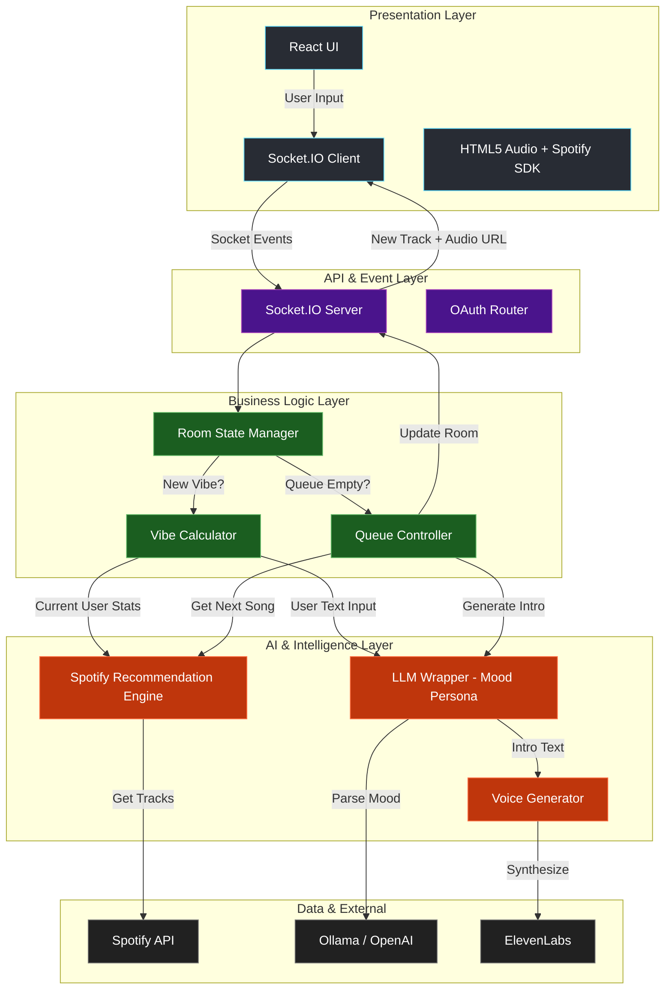
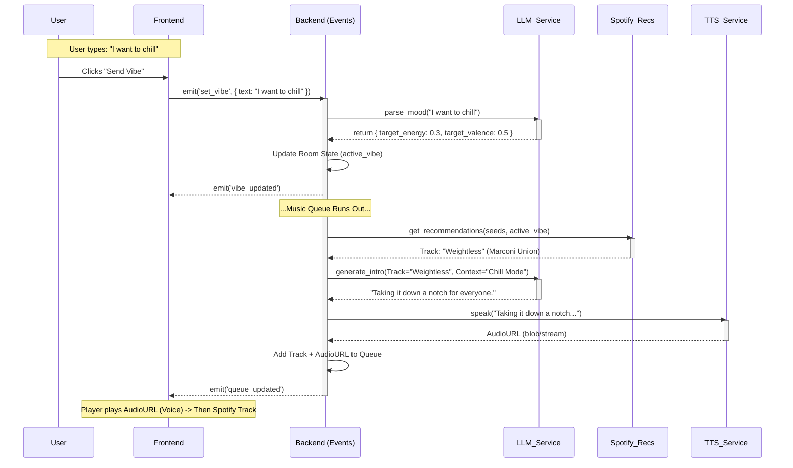

# Layer & Request Flow Diagrams

## 1. High-Level Layer Architecture
This diagram shows the separation of concerns between the Presentation (Frontend), Logic (Backend Core), AI Services, and External Providers.

---

## 2. Request Flow: "User Sets Vibe & AI Responds"
This sequence diagram illustrates the specific flow when a user says "I want to relax," triggering the entire chain.

